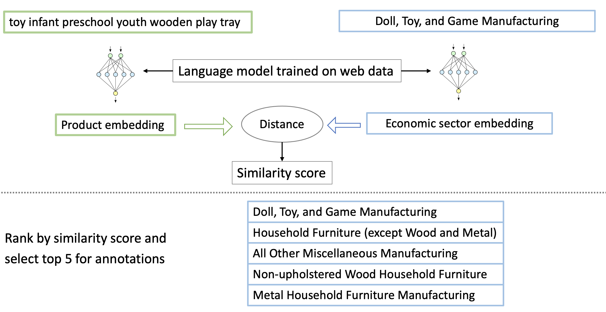

## Carbon assessment with machine learning

This is the code repository accompanying the following paper published in [WWW 2023](https://www2023.thewebconf.org/calls/special-tracks/web4good/) -- \
[CaML: Carbon Footprinting of Household Products with Zero-Shot Semantic Text Similarity](https://www.amazon.science/publications/caml-carbon-footprinting-of-household-products-with-zero-shot-semantic-text-similarity) \
Bharathan Balaji, Venkata Sai Gargeya Vunnava, Geoffrey Guest, Jared Kramer

## Task: Product carbon footprinting with EIO-LCA

Economic input-output life cycle assessment (EIO-LCA) is a method to estimate the cradle-to-gate carbon footprint of a product or activity based on its sale value. There are databases such as [USEEIO](https://www.epa.gov/land-research/us-environmentally-extended-input-output-useeio-technical-content) which publish the carbon emissions associated with industry sectors in the economy on a per unit currency basis. EIO-LCA estimates are compatible with [Greenhouse Gas Protocol](https://ghgprotocol.org/), and can be used for external reporting of scope 3 impacts. Given that the carbon emission estimate is only based on sale value of a product, it is an approximation and roughly within 2X the value of true emissions as per a [recent study](https://onlinelibrary.wiley.com/doi/pdf/10.1111/jiec.13271). 

We automate the process of mapping products to their EIO industry sectors based on text descriptions. This is one of the key steps in life cycle assessment that is done manually in practice. Our solution alleviates this manual overhead, and scales to any type of product. In a nutshell, we use a natural language model to match industry sectors based on semantic text similarity. The model is pre-trained on web data, and we use it as-is without additional training on products or industry sectors.

Figure below gives an overview of the text similarity model inference.



## Installation
Required packages are given `requirements.txt`
Run the following commands to install the package:
```
git clone https://github.com/amazon-science/carbon-assessment-with-ml.git
cd carbon-assessment-with-ml
pip install -r requirements.txt
pip install -e .
```

## Getting Started
Follow the code in `notebooks/demo_caml.ipynb`. 

## Dataset
The dataset consists of retail products mapped to North American Industry Classification System (NAICS) codes. The
mapping was done with Amazon Mechanical Turk, aggregating ground truth from 5 annotations per product. The dataset is the basis of estimating the carbon emissions of a product using Economic Input-Output Life Cycle Assessment (EIO-LCA). Dataset is stored as a Pandas dataframe. 

## Security

See [CONTRIBUTING](CONTRIBUTING.md#security-issue-notifications) for more information.

## License

This project is licensed under the terms of the Apache 2.0 license. See `LICENSE`.
Included datasets are licensed under the terms of the CDLA Permissive license, version 2.0. See `LICENSE-DATA`.

## Citation

Below is the BibTeX text, if you would like to cite our work.

```
@Inproceedings{Balaji2023,
 author = {Bharathan Balaji and Geoff Guest and Gargeya Vunnava and Jared Kramer},
 title = {CaML: Carbon footprinting of household products with zero-shot semantic text similarity},
 year = {2023},
 url = {https://www.amazon.science/publications/caml-carbon-footprinting-of-household-products-with-zero-shot-semantic-text-similarity},
 booktitle = {The Web Conference 2023},
}
```
